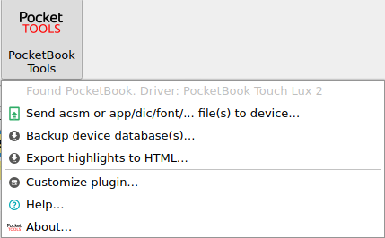
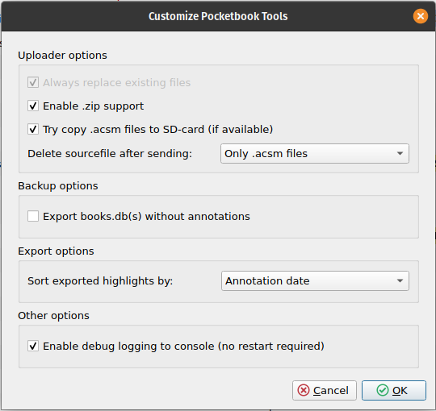

# Calibre PocketBook Tools plugin
A Calibre UI plugin that offers a collection of tools for PocketBook e-readers.

When Calibre recognises an USB connected PocketBook reader, the menu options should become available.
It should support most recent HD, Lux, Basic and Inkpad models. 

## Requirements
Plugin was tested with the 'PocketBook Lux 2' driver with Calibre versions 3.48-5.x, under Linux and Windows 10. Plugin will also run under 2.58 but could not be tested due to device driver issues (optionally, see CLI options of main.py). 

## Author(s)
- Highlight export improves upon script idea by retrography from https://www.mobileread.com/forums/showpost.php?p=3740634&postcount=36
- Building (and improving) upon parts from calibre-annotations and calibre-kobotools by davidfor and GRiker, and the Calibre Plugin tutorial by Kovid Goyal. Without their work this plugin would not be possible.
- William Ouwehand 2021+

## Screens

